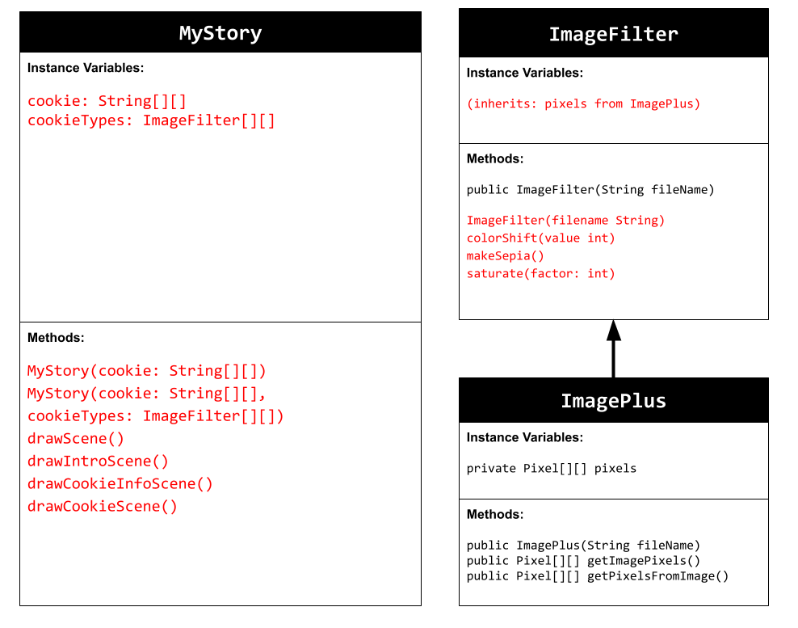

# Unit 4 - Personal Narrative

## Introduction

Images are often used to portray our personal experiences and interests. We also use image filters and effects to change or enhance the mood of an image. When combined into collages and presentations, these images tell a story about who we are and what is important to us. Your goal is to create a personal narrative using The Theater that consists of images of your personal experiences and/or interests, incorporates data related to these experiences and/or interests that can be organized in a 2D array, and uses image filters and effects to change or enhance the mood of your images.

## Requirements

Use your knowledge of object-oriented programming, two-dimensional (2D) arrays, and algorithms to create your personal narrative collage or animation:

- **Create at least two 2D arrays** – Create at least two 2D arrays to store the data that will make up your visualization.
- **Implement one or more algorithms** – Implement one or more algorithms that use loops and two-way or multi-selection statements with compound Boolean expressions to analyze the data.
- **Use Image Filters** - Include multiple image filters learned from this unit, and additionally create new ones of your own.
- **Use methods in the String class** – Use one or more methods in the String class in your program, such as to determine whether the name of an image file contains specific characters.
- **Create a visualization** – Create an image or animation that conveys the story of the data by illustrating the patterns or relationships in the data.
- **Document your code** – Use comments to explain the purpose of the methods and code segments and note any preconditions and postconditions.

## UML Diagram

UML Diagram for my project

## Video

Record a short video of your story to display here on your README. You can do this by:

- Screen record your project running on Code.org.
- Upload that recording to YouTube.
- Take a thumbnail for your image.
- Upload the thumbnail image to your repo.
- Use the following markdown

## Story Description

The animation tells a visual story of my creative journey as a baker who is into cookie baking, beginning with an inviting introduction that displays the title "My Favorite Cookies to Bake" alongside an appealing the audience with an image of an oatmealcookie filled with a gentle color shift effect. It helps set the stage for an abstract, and engaging narrative. While the animation focuses on vibrant imagery with minimal text to illustrate the intriguing options and art of baking, it also  incorporates key data elements represented in 2D arrays. These include a 2D String array holds the names of the cookies—such as "Chocolate Chip," "Dark Chocolate," "M&M Cookie," and "Sugar Cookie"—and a matching 2D ImageFilter array contains the images of these cookies. These are arranged in a grid and enhanced with filters like saturation, color shift, and sepia to program and display the fascinating and experimental features of the baking process. 
## Image Filter Analysis
In the animation, two key filters—colorShift and makeSepia—modify the image pixels. The colorShift filter increases each pixel’s red, green, and blue values by a specific amount, which help brightenthe image while making sure the values do not exceed over 255. The makeSepia filter estimates each pixel’s color channels using weighted averages to create a warm, brownish tone of vintage photos. Together, these filters showcase how pixel-level control can transform an image’s mood and style.